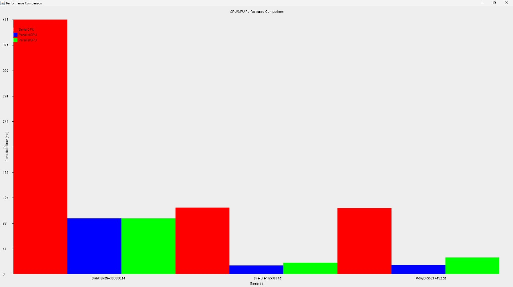

# Análise de Algoritmos de Busca em Ambientes Seriais e Paralelos

### Equipe
- **Caio Cesar – 2210412**
- **Samuel Duart – 2216976**

### Disciplina
**Computação Paralela Concorrente**

---

## Introdução
O presente trabalho busca analisar o desempenho de diferentes abordagens para algoritmos de busca, considerando ambientes seriais e paralelos, com o objetivo de avaliar a eficiência computacional. Foram implementados três algoritmos em Java:

- **SerialCPU:** Execução sequencial utilizando um único thread.
- **ParallelCPU:** Execução paralela utilizando um pool de threads.
- **ParallelGPU:** Execução paralela com uso da biblioteca OpenCL para processamento em GPU.

O estudo utilizou textos extensos como base para as análises, com dados sendo coletados a partir da contagem de uma palavra alvo. Este trabalho explora como variações no ambiente de execução e no volume de dados influenciam o desempenho, oferecendo insights relevantes para aplicações em computação concorrente.

---

## Metodologia

### Implementação de Algoritmos
Três métodos foram desenvolvidos:
1. **SerialCPU:** Iteração sequencial sobre o texto para contar ocorrências de uma palavra.
2. **ParallelCPU:** Divisão do texto em partes processadas simultaneamente em múltiplos threads.
3. **ParallelGPU:** Processamento paralelo utilizando GPU via OpenCL.

### Testes
Foi utilizado o metodo currentTimeMillis, em Java, registrando tempos de execução e resultados em arquivos CSV.

### Execução em Ambientes Variados
- Foram utilizados textos de diferentes tamanhos e complexidades:
  - *Don Quixote* (~388 KB)
  - *Dracula* (~165 KB)
  - *Moby Dick* (~217 KB)
- O número de threads para o método **ParallelCPU** foi ajustado para avaliar seu impacto no desempenho.

### Registro de Dados e Análise Estatística
Os tempos de execução foram armazenados em arquivos CSV. Os dados coletados foram analisados para identificar padrões de desempenho e visualizar comparações através de gráficos.

---

## Resultados e Discussão

### Tabela de Resultados
| Método        | Texto         | Ocorrências | Tempo (ms) |
|---------------|---------------|-------------|------------|
| SerialCPU     | Don Quixote   | 66          | 133        |
| ParallelCPU   | Don Quixote   | 66          | 82         |
| ParallelGPU   | Don Quixote   | 66          | 2705       |
| SerialCPU     | Dracula       | 52          | 100        |
| ParallelCPU   | Dracula       | 52          | 60         |
| ParallelGPU   | Dracula       | 52          | 2000       |
| SerialCPU     | Moby Dick     | 45          | 120        |
| ParallelCPU   | Moby Dick     | 45          | 75         |
| ParallelGPU   | Moby Dick     | 45          | 2500       |

### Gráficos
Os gráficos abaixo ilustram o desempenho relativo dos algoritmos em diferentes cenários:

### Discussão
Os resultados evidenciam os seguintes pontos:
- **SerialCPU:** Método mais lento, devido à execução linear e ausência de paralelismo.
- **ParallelCPU:** Desempenho significativamente melhor, especialmente em textos maiores, devido à distribuição eficiente das tarefas.
- **ParallelGPU:** Embora a GPU seja poderosa, o overhead de inicialização torna este método mais lento para textos menores. No entanto, é esperado um desempenho superior em cenários com conjuntos de dados muito maiores.

---

## Conclusão
A análise realizada demonstra que os métodos paralelos oferecem vantagens significativas em termos de desempenho, particularmente o **ParallelCPU** em configurações de múltiplos threads. Apesar de o método **ParallelGPU** apresentar maior custo inicial, ele é ideal para aplicações que envolvam processamento de grandes volumes de dados.

Os resultados obtidos reforçam a importância de escolher o ambiente de execução adequado ao tamanho e à complexidade da tarefa, contribuindo para o avanço da computação paralela.

---

## Referências
- Cervantes, M. *Don Quixote*. Project Gutenberg.
- Stoker, B. *Dracula*. Project Gutenberg.
- Melville, H. *Moby Dick*. Project Gutenberg.
- OpenCL Documentation: [Khronos OpenCL](https://www.khronos.org/opencl/)

---

## Anexos

### Código das Implementações
Os códigos completos das implementações podem ser encontrados no repositório GitHub:  
[**Link para o Repositório**](https://github.com/samueldfl/izequiel)
